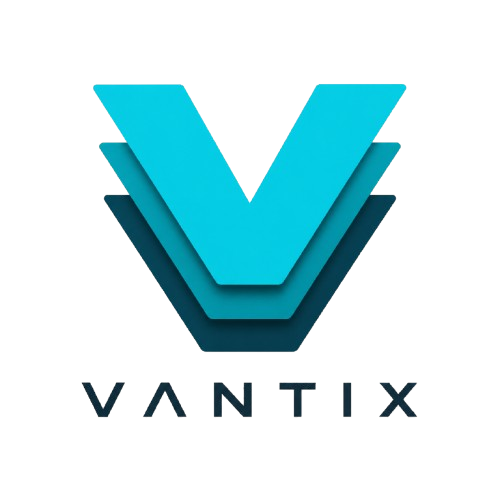
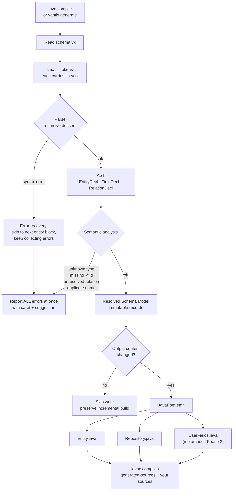
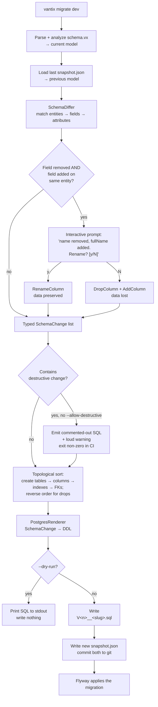
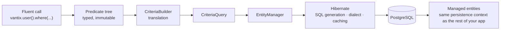
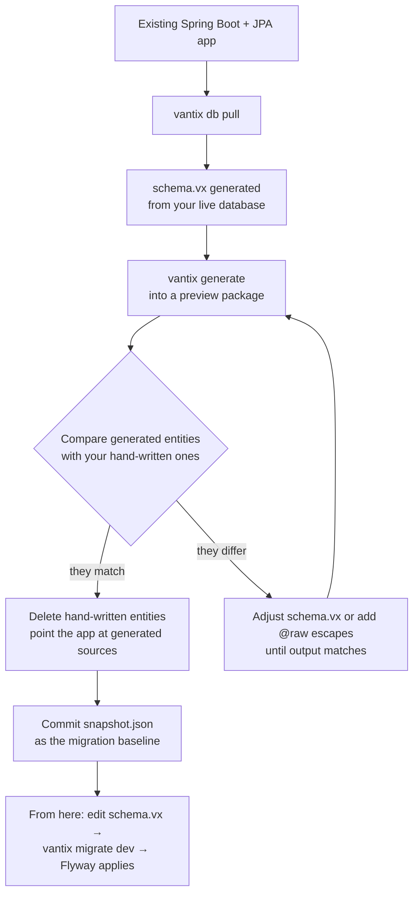
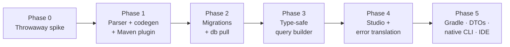

<p align="center">
  
</p>

<h1 align="center">Vantix</h1>

<p align="center">
  Prisma-grade developer experience for Spring Boot : one schema file, generated entities, automatic Flyway migrations, and type-safe queries. On top of Hibernate, not instead of it.
</p>

---

The problem you have right now: your domain model lives in three places at once. The Java entity says one thing, the Flyway migration says another, and the actual database has drifted from both. Adding a single column means editing an entity, hand-writing `V17__add_column.sql`, updating a DTO, updating a mapper, updating a repository method, and hoping you didn't typo a column name that only fails at runtime. You have Lombok, MapStruct, Flyway, springdoc, JPA Buddy, and QueryDSL — six tools with six mental models and no shared source of truth.

**Vantix** is a developer-experience toolchain that makes one declarative schema file the single source of truth. From `schema.vx` it generates your JPA entities, Spring Data repositories, and a type-safe query metamodel; it diffs schema versions to emit standard Flyway migrations; and it ships a local data browser and human-readable Hibernate error messages. Everything heavy happens at build time — at runtime your app is still plain Spring Data JPA on Hibernate, and you can eject at any moment.

---

## What It Does

- **Parses** a single `schema.vx` file — entities, fields, types, constraints, relations, indexes — with compiler-grade error messages (line, column, caret, "did you mean")
- **Generates** JPA entity classes with correct relation ownership, `mappedBy`, fetch defaults, and proxy-safe `equals`/`hashCode`
- **Generates** Spring Data `JpaRepository` interfaces, and (Phase 3) a typed field metamodel per entity (`UserFields`)
- **Diffs** the current schema against a committed snapshot of the last-migrated state and emits **standard Flyway `V__*.sql`** files you can read and edit before applying
- **Detects** destructive changes and refuses to emit them silently; prompts interactively to disambiguate renames from drop-and-add
- **Introspects** an existing PostgreSQL database into a `schema.vx` file (`vantix db pull`) so legacy projects can adopt Vantix incrementally
- **Compiles** a fluent, type-safe query API down to JPA Criteria — Hibernate still generates the SQL, manages the persistence context, and returns managed entities
- **Browses** and edits your data in a local web studio that talks straight to the database over JDBC (works even when your app doesn't compile)
- **Translates** cryptic Hibernate exceptions into diagnoses with ranked, actionable fixes
- **Integrates** with Maven so generation runs in `generate-sources` — generated code exists before your code compiles, with zero manual steps

---

## Feature Overview

| Feature                        | Description                                                                                                               |
| ------------------------------ | ------------------------------------------------------------------------------------------------------------------------- |
| **Schema DSL (`schema.vx`)**   | Declarative entities, scalar fields, enums, relations, indexes, and attributes in one file                                |
| **Compiler-grade diagnostics** | Multi-error reporting with source positions, error recovery, and suggestion hints                                         |
| **Entity generation**          | JPA entities into `target/generated-sources` — regenerated every build, never hand-edited                                 |
| **Repository generation**      | One `JpaRepository` per entity, plus derived finders for `@unique` fields                                                 |
| **Metamodel generation**       | Phase 3: typed field constants (`UserFields.EMAIL`, deliberately not `User_`) backing the query builder                  |
| **Migration generation**       | `vantix migrate dev` → snapshot diff → ordered DDL → Flyway-named SQL file                                                |
| **Rename detection**           | Interactive prompt when a drop+add is ambiguously a rename; preserves data when you confirm                               |
| **Destructive guard**          | `DROP COLUMN` / `DROP TABLE` require `--allow-destructive`; emitted commented-out otherwise                               |
| **Drift check**                | `vantix migrate diff --against-db` compares snapshot vs live database and reports divergence                              |
| **Database introspection**     | `vantix db pull` reads `information_schema` and writes a `schema.vx` for an existing DB                                   |
| **Type-safe query builder**    | Fluent `where`/`orderBy`/`include`/paging API compiled to JPA Criteria at runtime                                         |
| **Explicit fetching**          | `.include(UserFields.ADDRESS)` compiles to fetch joins / `EntityGraph` — the structural cure for `LazyInitializationException` |
| **Vantix Studio**              | Local-only web UI: browse tables, paginate, edit rows, inspect FKs                                                        |
| **Error translation**          | Spring Boot starter that rewrites common Hibernate exceptions into diagnosis + fixes                                      |
| **Maven plugin**               | Binds `generate` to the `generate-sources` phase; `mvn compile` is all a user needs                                       |
| **Ejectability**               | Generated code is plain, readable Spring code with no proprietary runtime — delete Vantix and keep working                |

---

## Architecture

Vantix is a **compile-time toolchain with a deliberately thin runtime**. Parsing, diffing, and code generation happen during the build. The only artifact that ships inside your application is `vx-runtime` — the query-builder execution layer and the error translator. Hibernate, Spring Data JPA, and Flyway are used unmodified.

```mermaid
flowchart LR
    SCHEMA["schema.vx<br/>single source of truth"]

    subgraph CLI["vantix CLI · vx-cli (picocli)"]
        direction TB
        C1["init · validate · generate"]
        C2["migrate dev · migrate diff"]
        C3["db pull · studio · doctor"]
    end

    subgraph CORE["vx-core"]
        direction TB
        LEX["Lexer<br/>tokens + SourcePosition"]
        PAR["Parser<br/>recursive descent"]
        SEM["Semantic Analyzer<br/>types · relations · diagnostics"]
        MODEL["Resolved Schema Model<br/>immutable records"]
        LEX --> PAR --> SEM --> MODEL
    end

    subgraph GEN["vx-codegen (JavaPoet)"]
        direction TB
        E["Entity generator"]
        R["Repository generator"]
        M["Metamodel generator<br/>(Phase 3)"]
    end

    subgraph MIG["vx-migrate"]
        direction TB
        SNAP["Snapshot store<br/>JSON of last migrated state"]
        DIFF["SchemaDiffer<br/>List&lt;SchemaChange&gt;"]
        SQL["PostgresRenderer<br/>ordered DDL"]
        INTRO["Introspector<br/>information_schema"]
        SNAP --> DIFF --> SQL
    end

    subgraph APP["Your Spring Boot application"]
        direction TB
        GENSRC["target/generated-sources<br/>entities · repositories · metamodel"]
        RT["vx-runtime<br/>query builder · error translator"]
        JPA["Spring Data JPA"]
        HIB["Hibernate ORM"]
        FW["Flyway"]
        PG[("PostgreSQL")]
        GENSRC --> JPA --> HIB --> PG
        RT --> HIB
        FW --> PG
    end

    STUDIO["vx-studio :5555<br/>localhost only"]

    SCHEMA --> CLI
    CLI --> CORE
    MODEL --> GEN
    MODEL --> MIG
    GEN -->|".java"| GENSRC
    SQL -->|"V__*.sql"| FW
    INTRO -->|"generates schema.vx"| SCHEMA
    C3 --> STUDIO
    STUDIO -->|"JDBC"| PG
```



**Why this shape**

| Decision                                       | Reasoning                                                                                                                                                                                                                                                                                                         |
| ---------------------------------------------- | ----------------------------------------------------------------------------------------------------------------------------------------------------------------------------------------------------------------------------------------------------------------------------------------------------------------- |
| **Build on Hibernate, don't replace it**       | Dirty checking, proxies, caching, inheritance mapping, dialects, optimistic locking — decades of solved problems. Reimplementing them is a multi-year project with no upside. Hibernate 7's own direction (Jakarta Data, compile-time query checking) means sitting above it absorbs their improvements for free. |
| **Emit Flyway SQL, don't run migrations**      | Vantix _writes_ migrations; Flyway _runs_ them. You inherit Flyway's checksums, CI/CD story, and — critically — user trust. Generated SQL that a human reviews before applying is the correct compromise.                                                                                                         |
| **Thin runtime, heavy build step**             | Zero runtime performance risk, zero interference with the persistence context, and full ejectability.                                                                                                                                                                                                             |
| **Snapshot diffing, not live-DB diffing**      | Deterministic, works offline and in CI, keeps the schema file authoritative. Local databases accumulate manual changes; diffing against them produces noise.                                                                                                                                                      |
| **Generated metamodel, not lambda reflection** | `u -> u.email()` looks elegant but needs `SerializedLambda` reflection — fragile across JVMs, hostile to native-image, worse IDE completion. jOOQ, QueryDSL, and JPA's own metamodel all converged on generated constants.                                                                                        |

---

## The Generation Pipeline



Generated sources land in `target/generated-sources/vantix` and are **excluded from version control**. They are disposable by design: regenerate them from the schema at any time. User customization happens through the **Generation Gap pattern** — Vantix emits `abstract UserBase`, and scaffolds `User extends UserBase` exactly once, then never touches it again.

---

## The Migration Engine

`vantix migrate dev` compares the schema you just edited against a JSON snapshot of the schema as of the last migration. That diff produces a list of typed `SchemaChange` records, which a Postgres renderer turns into ordered DDL.



### Change Types

| Change Type                            | Destructive | Emitted DDL                       |
| -------------------------------------- | ----------- | --------------------------------- |
| `CreateTable`                          | no          | `CREATE TABLE`                    |
| `AddColumn` (nullable or with default) | no          | `ALTER TABLE … ADD COLUMN`        |
| `AddColumn` (NOT NULL, no default)     | **yes**     | requires backfill strategy        |
| `RenameColumn`                         | no          | `ALTER TABLE … RENAME COLUMN`     |
| `AlterColumnType` (widening)           | no          | `ALTER TABLE … TYPE`              |
| `AlterColumnType` (narrowing)          | **yes**     | may truncate data                 |
| `AddIndex` / `AddUnique`               | no          | `CREATE INDEX` / `ADD CONSTRAINT` |
| `AddForeignKey`                        | no          | `ADD CONSTRAINT … FOREIGN KEY`    |
| `DropColumn`                           | **yes**     | `ALTER TABLE … DROP COLUMN`       |
| `DropTable`                            | **yes**     | `DROP TABLE`                      |
| `DropIndex` / `DropConstraint`         | no          | `DROP INDEX` / `DROP CONSTRAINT`  |

Migration files are **immutable once applied** — Flyway's checksums enforce this. Vantix never rewrites a previously emitted migration; a mistake is corrected with a new one.

---

## The Schema Language

```
// schema.vx

datasource {
  provider = "postgresql"
  url      = env("DATABASE_URL")
}

generator {
  package        = "com.acme.shop"
  output         = "target/generated-sources/vantix"
  generateDtos   = false          // phase 2
}

enum OrderStatus {
  PENDING
  PAID
  SHIPPED
  CANCELLED
}

entity User {
  id        Long      @id @generated
  email     String    @unique @length(180)
  name      String    @length(120)
  createdAt Instant   @default(now())
  orders    Order[]                        // one-to-many, inverse side
  profile   Profile?                       // one-to-one, optional

  @@index([createdAt])
  @@table("users")
}

entity Profile {
  id      Long    @id @generated
  bio     String? @length(500)
  user    User    @relation(fields: [userId], references: [id])
  userId  Long    @unique
}

entity Order {
  id       Long        @id @generated
  status   OrderStatus @default(PENDING)
  total    Decimal     @precision(12, 2)
  placedAt Instant     @default(now())
  user     User        @relation(fields: [userId], references: [id], onDelete: Restrict)
  userId   Long
  items    OrderItem[]

  @@index([userId, placedAt])
}
```

### Type Mapping

| Vantix type     | Java type             | PostgreSQL type                   |
| --------------- | --------------------- | --------------------------------- |
| `String`        | `String`              | `varchar(n)` / `text`             |
| `Int`           | `Integer`             | `integer`                         |
| `Long`          | `Long`                | `bigint`                          |
| `Decimal`       | `BigDecimal`          | `numeric(p,s)`                    |
| `Float`         | `Double`              | `double precision`                |
| `Boolean`       | `Boolean`             | `boolean`                         |
| `Instant`       | `Instant`             | `timestamptz`                     |
| `LocalDate`     | `LocalDate`           | `date`                            |
| `LocalDateTime` | `LocalDateTime`       | `timestamp`                       |
| `UUID`          | `UUID`                | `uuid`                            |
| `Json`          | `String` / `JsonNode` | `jsonb`                           |
| `Bytes`         | `byte[]`              | `bytea`                           |
| `<Enum>`        | generated Java `enum` | `varchar` + check, or native enum |
| `T?`            | nullable `T`          | nullable column                   |
| `T[]`           | `List<T>`             | (relation — no column)            |

### Field Attributes

| Attribute                                    | Effect                                                   |
| -------------------------------------------- | -------------------------------------------------------- |
| `@id`                                        | Primary key → `@Id`                                      |
| `@generated`                                 | Identity/sequence generation → `@GeneratedValue`         |
| `@unique`                                    | Unique constraint + derived `findByX` repository method  |
| `@default(value)`                            | Column default; `now()`, `uuid()`, literals              |
| `@length(n)`                                 | `varchar(n)` + `@Size` validation                        |
| `@precision(p, s)`                           | `numeric(p,s)` for `Decimal`                             |
| `@column("name")`                            | Explicit column name override                            |
| `@relation(fields:, references:, onDelete:)` | Owning side of an association + FK behavior              |
| `@updatedAt`                                 | Auto-managed timestamp → `@UpdateTimestamp`              |
| `@ignore`                                    | Present in Java, absent from the database (`@Transient`) |
| `@raw("...")`                                | Escape hatch: emit this column DDL verbatim              |

### Entity-Level Attributes

| Attribute          | Effect                      |
| ------------------ | --------------------------- |
| `@@table("name")`  | Table name override         |
| `@@index([a, b])`  | Composite index             |
| `@@unique([a, b])` | Composite unique constraint |
| `@@id([a, b])`     | Composite primary key       |
| `@@schema("name")` | PostgreSQL schema placement |

---

## Type-Safe Queries

> **Phase 3 — not available yet.** This section is the API design the query builder is being built against.

The metamodel generator emits a typed constant per field, in a class named `UserFields` — deliberately not `User_`, which is the name Hibernate's own `hibernate-jpamodelgen` generates; two processors writing `com.acme.User_` would be a duplicate-class error in your build (decision D3). The fluent API composes those constants and compiles the result to JPA Criteria — Hibernate still produces the SQL, applies the dialect, and returns managed entities.

```java
// Instead of: @Query("select u from User u where u.email = :email")
User user = vantix.user()
        .where(UserFields.EMAIL.eq(email))
        .fetchOne()
        .orElseThrow();

// Composable predicates, explicit fetching, pagination
Page<Order> orders = vantix.order()
        .where(OrderFields.STATUS.in(PAID, SHIPPED)
          .and(OrderFields.PLACED_AT.after(cutoff))
          .and(OrderFields.USER.dot(UserFields.EMAIL).endsWith("@acme.com")))
        .include(OrderFields.ITEMS)     // fetch join — no lazy-init surprise
        .orderBy(OrderFields.PLACED_AT.desc())
        .page(0, 50)
        .fetchPage();
```



**Escape hatch.** Criteria has an expressiveness ceiling — window functions, recursive CTEs, exotic vendor SQL. Vantix does not chase 100% coverage; it gives you `vantix.raw("select ...", Type.class)` and gets out of the way. Prisma takes the same position with `$queryRaw`.

---

## Better Error Messages

The `vantix-spring-boot-starter` intercepts common persistence exceptions and rewrites them with a diagnosis and ranked fixes.

**Before**

```
org.hibernate.LazyInitializationException: could not initialize proxy
  [com.acme.shop.Address#42] - no Session
```

**After**

```
✗ User.address was accessed outside an open transaction.

  The association is LAZY, and the persistence context that loaded
  User#42 was already closed when .getAddress() was called.
  Accessed at: OrderService.summarise(OrderService.java:88)

  Ranked fixes:
   1. Fetch it up front:      .include(UserFields.ADDRESS)
   2. Use an entity graph:    @EntityGraph(attributePaths = "address")
   3. Widen the transaction:  @Transactional on the calling method
      (only if the caller genuinely owns the unit of work)

  Why not EAGER? It fixes this call site and silently degrades every
  other query that loads a User.  →  vantix.dev/errors/VX-1002
```

Every translated error carries a stable code (`VX-1002`) linking to documentation. This starter is independently useful — you can add it to an existing Hibernate project without adopting anything else in Vantix.

---

## Vantix Studio

```
vantix studio
# → http://localhost:5555?token=8f2c1a...   (printed to your terminal)
```

```
┌────────────────────────────────────────────────────────────────┐
│  Vantix Studio          db: shop@localhost:5432    [⟳ Refresh] │
├───────────────┬────────────────────────────────────────────────┤
│  Tables       │  users                          1,284 rows     │
│  ───────────  │  ┌──────┬───────────────────┬───────────────┐  │
│  ▸ users      │  │ id   │ email             │ created_at    │  │
│  ▸ profiles   │  ├──────┼───────────────────┼───────────────┤  │
│  ▸ orders     │  │ 1    │ ada@acme.com      │ 2026-01-14…   │  │
│  ▸ order_items│  │ 2    │ linus@acme.com    │ 2026-01-15…   │  │
│               │  └──────┴───────────────────┴───────────────┘  │
│  [+ filter]   │  ‹ 1 2 3 … 26 ›     [＋ Add row] [Save edits]  │
└───────────────┴────────────────────────────────────────────────┘
```

Studio talks to the database over **plain JDBC**, not through your entities — so it still works when your application doesn't compile, which is exactly when you most want to look at your data. It binds to `localhost` only and requires a random session token printed to the terminal on startup.

---

## Tech Stack

| Layer             | Technology                                                                              |
| ----------------- | --------------------------------------------------------------------------------------- |
| Language          | Java 21 (records, sealed interfaces, pattern matching)                                  |
| Parser            | Hand-written lexer + recursive-descent parser (no ANTLR dependency)                     |
| Code generation   | [JavaPoet](https://github.com/palantir/javapoet) (Palantir fork — Square's is archived) |
| CLI               | [picocli](https://picocli.info)                                                         |
| Build integration | Maven Plugin API (`@Mojo`, `generate-sources` phase)                                    |
| Target ORM        | Hibernate ORM 7 via Spring Data JPA (Boot 4.1); generated code also CI-tested on 6.6 / Boot 3.5 |
| Migrations        | Flyway (Vantix emits, Flyway executes)                                                  |
| Database (v1)     | PostgreSQL 14–17                                                                        |
| Studio backend    | Spring Boot + JDBC + `information_schema`                                               |
| Studio frontend   | React 19, TypeScript 5, Tailwind CSS v4                                                 |
| Testing           | JUnit 5, Testcontainers, golden-file snapshots, Java Compiler API                       |
| Distribution      | Maven Central · Maven plugin · standalone JAR · GraalVM native binary                   |

---

## Project Structure

```
vantix/
├── pom.xml                          Parent POM — dependency management, module list
├── vx-core/                         SDL front end (no Spring, no JavaPoet)
│   └── src/main/java/dev/vantix/core/
│       ├── lexer/                   Token, Lexer, SourcePosition
│       ├── parser/                  Recursive-descent Parser, error recovery
│       ├── ast/                     Ast: syntax-tree records (EntityDecl, FieldDecl, AttributeDecl, ...)
│       ├── semantic/                SchemaAnalyzer: types, relations, mappedBy, naming rules
│       ├── diagnostic/              Diagnostic, renderer (caret + related locations), did-you-mean
│       └── model/                   Resolved Schema model — the contract every module consumes
├── vx-codegen/                      Schema model → Java source (JavaPoet)
│   └── src/main/java/dev/vantix/codegen/
│       ├── EntityGenerator          Entities (mappedBy, equals/hashCode, fetch defaults, Generation Gap)
│       ├── RepositoryGenerator      JpaRepository + derived finders for @unique fields
│       ├── SourceWriter             Skips identical files, prunes stale ones, never overwrites scaffolds
│       └── (Phase 3/5)              Metamodel (`UserFields`), DTO + mapper generation
├── vx-migrate/                      Schema diff → SQL
│   └── src/main/java/dev/vantix/migrate/
│       ├── snapshot/                Snapshot serialize/deserialize (JSON)
│       ├── diff/                    SchemaDiffer → sealed List<SchemaChange>
│       ├── sql/                     PostgresRenderer, topological DDL ordering
│       └── introspect/              information_schema reader — powers db pull & drift check
├── vx-runtime/                      Ships inside the user's app — keep dependencies near zero
│   └── src/main/java/dev/vantix/runtime/
│       ├── query/                   Fluent API → CriteriaQuery compilation
│       └── error/                   Hibernate exception translation
├── vx-cli/                          picocli commands; depends on core + codegen + migrate
├── vx-maven-plugin/                 GenerateMojo bound to generate-sources
├── vx-spring-boot-starter/          Auto-config: query client bean, error translator
├── vx-studio/                       Spring Boot + React data browser
├── examples/demo-app/               Dogfood app — also the end-to-end integration test bed
└── docs/                            Documentation site source
```

**Why multi-module.** Each pillar has different dependencies (the CLI must not drag in Spring; the runtime must stay tiny; only codegen needs JavaPoet), different release cadences, and clean seams for testing. Flyway, jOOQ, and Prisma are all organized the same way.

---

## Quick Start

### Prerequisites

- **Java 21** — e.g. via [SDKMAN](https://sdkman.io/): `sdk install java 21-tem`
- **Maven 3.9+** (or the included `./mvnw` wrapper)
- **Docker** — for a local PostgreSQL instance
- **Node.js 20+** — only if you're building Studio from source

### 1. Add the Maven plugin

```xml
<build>
  <plugins>
    <plugin>
      <groupId>dev.vantix</groupId>
      <artifactId>vx-maven-plugin</artifactId>
      <version>0.1.0</version>
      <executions>
        <execution>
          <goals><goal>generate</goal></goals>   <!-- binds to generate-sources -->
        </execution>
      </executions>
    </plugin>
  </plugins>
</build>

<dependencies>
  <dependency>
    <groupId>dev.vantix</groupId>
    <artifactId>vx-spring-boot-starter</artifactId>
    <version>0.1.0</version>
  </dependency>
</dependencies>
```

### 2. Initialize

```bash
mvn vantix:init
# creates  vantix/schema.vx  (a starter schema, in <your @SpringBootApplication package>.model)
#          a .gitignore entry for target/generated-sources/vantix/
```

### 3. Write your schema

```
entity User {
  id    Long   @id @generated
  email String @unique @length(180)
  name  String @length(120)
}
```

### 4. Generate and migrate

```bash
mvn compile                    # runs vantix:generate automatically
mvn vantix:migrate -Dargs=dev  # Phase 2 (not yet available): diffs, prompts, writes the migration
```

`mvn compile` works today: entities and repositories land in `target/generated-sources/vantix`, and a schema error fails the build with the same diagnostics `vantix validate` prints. Migration generation arrives in Phase 2; review the emitted SQL, then let Flyway apply it on the next application start.

### 5. Use it

```java
@Service
@RequiredArgsConstructor
public class UserService {
    private final UserRepository users;           // generated from schema.vx

    public Optional<User> byEmail(String email) {
        return users.findByEmail(email);          // generated because `email` is @unique
    }
}
```

With the Phase 3 query builder the same lookup becomes `vantix.user().where(UserFields.EMAIL.eq(email)).fetchOne()`.

### 6. Browse your data

```bash
mvn vantix:studio
# → http://localhost:5555?token=…
```

---

## CLI Reference

### Schema & Generation

| Command                   | Description                                                                                  |
| ------------------------- | -------------------------------------------------------------------------------------------- |
| `vantix init`             | Scaffold `vantix/schema.vx` and a `.gitignore` entry for the generated sources               |
| `vantix validate`         | Parse and semantically check the schema; report all errors at once; exit non-zero on failure |
| `vantix generate`         | Emit entities and repositories into the configured output directory (metamodel: Phase 3)     |
| `vantix generate --watch` | Regenerate on schema file change (watches the directory, so rename-on-save editors work)    |
| `vantix format`           | Canonically format `schema.vx` (alignment, ordering)                                         |

### Migrations

| Command                                    | Description                                                                               |
| ------------------------------------------ | ----------------------------------------------------------------------------------------- |
| `vantix migrate dev`                       | Diff schema against snapshot, prompt for renames, write a Flyway migration + new snapshot |
| `vantix migrate dev --name add_user_email` | Explicit migration slug instead of an inferred one                                        |
| `vantix migrate dev --dry-run`             | Print the SQL that _would_ be generated; write nothing                                    |
| `vantix migrate dev --allow-destructive`   | Permit `DROP`-class statements to be emitted uncommented                                  |
| `vantix migrate diff --against-db`         | Compare the snapshot against the live database; report drift                              |
| `vantix migrate status`                    | Show which migrations exist, which are applied, and whether the snapshot is current       |

### Database

| Command          | Description                                                                     |
| ---------------- | ------------------------------------------------------------------------------- |
| `vantix db pull` | Introspect an existing database and write a `schema.vx` describing it           |
| `vantix db push` | Apply the schema directly without generating a migration (**prototyping only**) |
| `vantix studio`  | Start the local data browser on `localhost:5555` with a session token           |

### Diagnostics

| Command                  | Description                                                                                               |
| ------------------------ | --------------------------------------------------------------------------------------------------------- |
| `vantix doctor`          | Check Java version, datasource reachability, Flyway config, snapshot/migration consistency, plugin wiring |
| `vantix --version`       | Version and build info                                                                                    |
| `vantix <cmd> --verbose` | Full debug logging, including the differ's decision trail                                                 |
| `vantix <cmd> --json`    | Machine-readable output for CI pipelines                                                                  |

---

## Configuration Reference

All configuration lives in `vantix/schema.vx` (decision D8), so `vantix generate` and `mvn compile` can never disagree. The Maven plugin's only settings are where that file is (`schemaPath`, default `vantix/schema.vx`) and `vantix.skip`.

```
datasource {
  provider = "postgresql"
  url      = env("DATABASE_URL")        // never hard-code credentials
  schema   = "public"
}

generator {
  package          = "com.acme.shop"
  output           = "target/generated-sources/vantix"   // relative to the project base directory
  entitySuffix     = ""                 // e.g. "Entity" → UserEntity
  generateRepos    = true
  generateMetamodel = false             // Phase 3
  generateDtos     = false              // Phase 5
  useGenerationGap = false              // true → abstract UserBase + editable User
}

// Phase 2 — today this block is rejected with a clear error
migrations {
  directory        = "src/main/resources/db/migration"   // Flyway's default
  versionPrefix    = "V"
  allowDestructive = false
  renameStrategy   = "prompt"           // prompt | never | always-rename
}
```

**Environment variables**

| Variable                   | Default            | Purpose                                         |
| -------------------------- | ------------------ | ----------------------------------------------- |
| `DATABASE_URL`             | —                  | JDBC URL used by `migrate`, `db pull`, `studio` |
| `VANTIX_SCHEMA_PATH`       | `vantix/schema.vx` | Schema file location override                   |
| `VANTIX_NO_COLOR`          | unset              | Disable ANSI colors in CLI output               |
| `VANTIX_STUDIO_PORT`       | `5555`             | Studio port                                     |
| `VANTIX_ALLOW_DESTRUCTIVE` | `false`            | CI-friendly equivalent of `--allow-destructive` |

`output` is resolved against the project base directory (the Maven `${basedir}`, or `--project-dir` for the CLI) and must stay inside it: absolute paths and `..` escapes are rejected, so a schema file in a pull request cannot make the generator write, or prune, anywhere else.

Credentials are read from the environment only. Vantix never writes a connection string into a schema file, a snapshot, a log line, or an error message.

---

## Adopting Vantix in an Existing Project

Vantix is designed for **incremental adoption** — it does not require a greenfield project or a big-bang rewrite.



Three properties make this safe:

1. **Your existing Flyway migrations are untouched.** Vantix names new migrations `V<yyyyMMddHHmmss>__<slug>.sql` (decision D11). A timestamp version always sorts after your existing `V1`…`V17`, so Vantix never needs to know your numbering and never writes into its range; everything before the baseline is history.
2. **Generated code is ordinary Spring code.** If you decide against Vantix, copy the generated sources into `src/main/java`, delete the plugin, and nothing breaks.
3. **You can adopt one pillar at a time.** The error-translation starter works standalone. So does `db pull`. So does migration generation without code generation.

---

## Testing Strategy

| Layer                 | Approach                                                                                                                                                                                 |
| --------------------- | ---------------------------------------------------------------------------------------------------------------------------------------------------------------------------------------- |
| **Lexer / Parser**    | Table-driven tests over valid inputs _and_ a large corpus of invalid inputs asserting on the exact diagnostic text — error messages are a headline feature, so they get regression tests |
| **Semantic analyzer** | Property-style tests: every invalid model shape produces exactly one diagnostic with a correct source position                                                                           |
| **Codegen**           | Golden-file snapshots (`expected/User.java`) diffed against actual output, plus a compilation smoke test that feeds generated sources to the Java Compiler API and asserts zero errors   |
| **Differ**            | Pure unit tests on model pairs — no database. Round-trip property: apply the generated changes to snapshot A and assert the result equals B                                              |
| **SQL renderer**      | Testcontainers against real PostgreSQL 14–17; the generated DDL must actually execute                                                                                                    |
| **Introspection**     | Round-trip test: `schema.vx` → SQL → apply → `db pull` → compare against the original                                                                                                    |
| **Maven plugin**      | `maven-invoker-plugin` integration tests on a real throwaway project                                                                                                                     |
| **End-to-end**        | CI job runs `init → generate → migrate → boot → query` against the demo app on every push                                                                                                |

---

## Project Status & Roadmap

> **Vantix is pre-alpha and under active development.** The schema language and CLI surface are not yet stable. Do not point it at a production database.



| Phase | Scope                                                               | Status |
| ----- | ------------------------------------------------------------------- | ------ |
| **0** | End-to-end throwaway spike to feel every stage                      | ✅     |
| **1** | SDL grammar, lexer, parser, semantic analysis, `validate`           | ✅     |
| **1** | Entity + repository generation, Maven plugin, demo app green        | ✅     |
| **2** | Snapshot format, `SchemaDiffer`, Postgres renderer, `migrate dev`   | ☐      |
| **2** | Rename prompts, destructive guard, `--dry-run`                      | ☐      |
| **2** | `db pull` introspection + round-trip test                           | ☐      |
| **3** | Metamodel generation, fluent API, Criteria compilation, starter     | ☐      |
| **4** | Error-translation starter (independently shippable)                 | ☐      |
| **4** | Studio: browse, paginate, edit, FK navigation                       | ☐      |
| **5** | Gradle plugin, `doctor`, DTO/mapper generation, OpenAPI annotations | ☐      |
| **5** | GraalVM native CLI, `.vx` syntax highlighting, docs site            | ☐      |

**Deliberately out of scope for v1:** databases other than PostgreSQL, Kotlin support, a custom migration runner, replacing any part of Hibernate's runtime, and a full IntelliJ plugin.

---

## Design Notes & Known Hard Problems

**Rename detection is undecidable.** If `name` disappears and `fullName` appears, no algorithm can know whether that's a rename or a drop-and-add — the answer lives in the developer's head. Vantix asks, defaults to the safe answer, and records the decision in the snapshot so it never asks twice. Any tool that claims to solve this automatically is guessing with your data.

**Generated code must not be edited.** Java has no partial classes, so there's no way to merge your edits with regenerated output. Vantix's answer is the Generation Gap pattern (`abstract UserBase` + scaffolded-once `User`) plus `@raw` escapes in the schema. This is the single most common way code generators die, so it's decided up front rather than patched later.

**Entity `equals`/`hashCode` is subtle.** Generated entities use id-based equality (through `getId()`, never the field, which is null on an uninitialized proxy) and a constant per-class `hashCode`, so an instance put in a `HashSet` before it is saved is still found after. The effective class comes from the proxy's `LazyInitializer.getPersistentClass()`, which never loads anything. `Hibernate.getClass()` would initialize the proxy, and `Hibernate.getClassLazy()` throws `LazyInitializationException` on a detached proxy. Both methods are `final`, so Hibernate's proxy cannot intercept them: `proxy.equals(entity)` and `HashSet.add(proxy)` do not load the row either. The demo app tests all of this against real proxies, and a deliberate `other.id` mutation fails those tests. A generator amplifies every mistake across every user's domain model, which is why this gets that much testing.

**Criteria has a ceiling.** Window functions, recursive CTEs, and vendor-specific SQL don't round-trip cleanly. Vantix exposes `raw()` rather than pretending otherwise.

**Incremental builds matter.** Rewriting unchanged files with fresh timestamps forces full recompiles and makes the tool feel slow. Vantix compares generated content with what is on disk and leaves identical files untouched, so a no-op `mvn compile` compiles nothing (an integration test checks exactly that). The scope is honest: Maven's compiler plugin recompiles the whole module when any source changes, so a real schema change still recompiles the module. Vantix makes no-op builds free; it does not make per-entity recompiles possible.

---

## Production Notes

- Set `spring.jpa.hibernate.ddl-auto: validate` in production — never `update`. Vantix generates migrations precisely so Hibernate doesn't have to guess.
- Commit `vantix/schema.vx`, the new `src/main/resources/db/migration/V*.sql`, and `vantix/snapshot.json` together in the same commit. A migration without its snapshot will make the next diff wrong.
- Never edit an applied migration. Flyway's checksums will reject it, and rightly so — write a new one.
- Run `vantix validate` and `vantix migrate diff --against-db` in CI. The first catches schema errors before compile; the second catches manual database changes that bypassed the pipeline.
- `db push` is a prototyping tool. It skips migration history entirely. Gate it to local development.
- Studio binds to `localhost` with a session token by default. Do not expose it through a reverse proxy.
- Generated sources belong in `target/`, not in version control. Treat them exactly like compiled classes.

---

## Contributing

Vantix is Apache-2.0 licensed and welcomes contributions. The most valuable areas right now are the SQL renderer (additional PostgreSQL features), the diagnostic corpus (real-world schema mistakes that deserve better messages), and dialect support beyond PostgreSQL.

```bash
git clone https://github.com/Tanmay-Anand/vantix
cd vantix
./mvnw verify            # unit + Testcontainers integration tests
./mvnw -pl examples/demo-app spring-boot:run
```

---

## License

Apache-2.0
